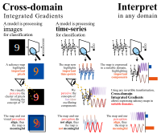

# Timeseries Saliency Maps: Explaining models across multiple domains

Official reproduction repository for the paper "*Timeseries Saliency Maps: Explaining models across multiple domains*". 

Our plug-and-play Tensorflow/PyTorch library for Cross-domain IG can be found [here](https://github.com/esl-epfl/cross-domain-saliency-maps).

# Absract 
Traditional saliency map methods, popularized in computer vision, highlight individual points (pixels) of the input which contribute the most to the model's output. However, in time-series they offer limited insights as semantically meaningful features are often found in other domains. We introduce Cross-domain Integrated Gradients, a generalization of Integrated Gradients. Our method enables feature attributions on any domain which can be formulated as an invertible, differentiable transformation of the time-domain. Crucially, our derivation extends the original Integrated Gradients into the complex domain, enabling frequency-based attributions. We provide the necessary theoretical guarantees, namely path-independence and completeness. Our approach reveals interpretable, problem-specific attributions that time-domain methods cannot capture, on three real-world tasks — wearable-sensor heart-rate extraction, electroencephalography-based seizure detection, and zero-shot time-series forecasting. We release an open-source Tensorflow/PyTorch library to enable plug-and-play cross-domain explainability for time-series models. These results demonstrate ability of Cross‑domain Integrated Gradients to provide semantically meaningful insights in time‑series models that are impossible with traditional time‑domain saliency.




# Experiments

# Install requirements


Each sub-project has its own requirements and should be run on different
environment to avoid version conflicts. The requirements.txt file for
each sub-project is located at the corresponding folder. See the README
files in each subdirectory:
1. [Preliminary Cross-Domain Integrated Gradients exploration](./preliminaries/README.md)
2. [Frequency-Domain IG](./ppg_kidppg/README.md)
3. [IG in the Independent Component Analysis domain](./eeg_zhu_transformer/README.md)
4. [Seasonal-Trend IG](./timesfm/README.md)

The code was developed and tested on Python v3.10.16.

## Heart Rate Inference
Experiments for heart rate inference from photoplethysmography signals can be found in the [ppg_kidppg](./ppg_kidppg/) folder.


## Epilepsy detection 
Experiments for epilepsy detection from electroencephalography (EEG) signals are located in [eeg_zhu_transformer](./eeg_zhu_transformer/).

The ```zhu_transformer``` implementation along with the weights can be found [here](https://github.com/esl-epfl/zhu_2023).

## Foundation model forecasting
The experiments for time-series forecasting using a foundation model are found in [timesfm](./timesfm/).

For the foundation model we are using [TimesFM](https://github.com/google-research/timesfm).

# Reference 
```
TODO
```