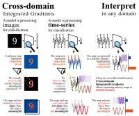

# Timeseries Saliency Maps: Explaining models across multiple domains

Official reproduction repository for the paper "*Timeseries Saliency Maps: Explaining models across multiple domains*". 

Our plug-and-play Tensorflow/PyTorch library for Cross-domain IG can be found [here](https://github.com/esl-epfl/cross-domain-saliency-maps).

# Absract 
Traditional saliency map methods, popularized in computer vision, highlight individual points (pixels) of the input that contribute the most to the model's output. However, in time series, they offer limited insights, as semantically meaningful features are often found in other domains. We introduce Cross-domain Integrated Gradients, a generalization of Integrated Gradients. Our method enables feature attributions in any domain that can be formulated as an invertible, differentiable transformation of the time domain. Crucially, our derivation extends the original Integrated Gradients into the complex domain, enabling frequency-based attributions. We provide the necessary theoretical guarantees, namely, path independence and completeness. We validate our method via controlled experiments with mechanistic analysis, quantitative faithfulness tests, and real-world case studies. Our approach reveals interpretable, problem-specific attributions that time-domain methods cannot capture in three real-world tasks across a variety of model architectures, machine-learning tasks, and cross-domain transforms: frequency-based attribution for a regression task in wearable heart rate extraction, independent component analysis in a classification task for electroencephalography-based seizure detection, and seasonal-trend decomposition for a forecasting problem with a zero-shot time-series foundation model. We release an open-source TensorFlow/PyTorch library to enable plug-and-play cross-domain explainability for time-series models. These results demonstrate the ability of Cross-Domain Integrated Gradients to provide semantically meaningful insights into time-series models that are impossible to achieve with traditional saliency in the time domain.



# Reference 
```
TODO
```